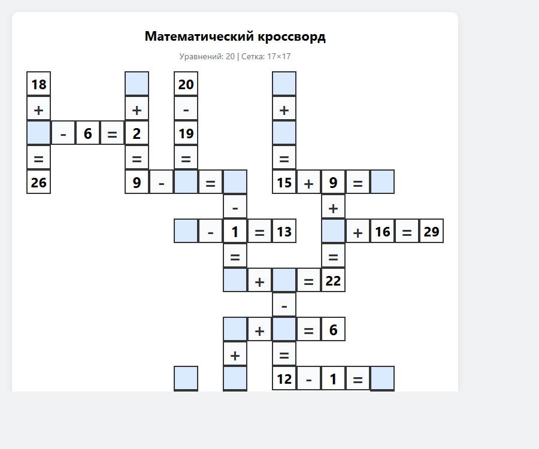

# Математический кроссворд

Веб-приложение для генерации математических кроссвордов. Уравнения вида `A ± B = C` размещаются в сетке по принципу классического кроссворда — пересекаясь общими цифрами. Готовый кроссворд можно распечатать или скачать как PDF.

## Возможности

- Генерация сетки из 10–50 уравнений с операциями `+`, `-`, `×`
- Настройка диапазона чисел (от 1 до 100)
- Управление сложностью: процент скрытых клеток (10–80%)
- Просмотр ответов прямо в браузере
- Экспорт в PDF (формат A4)
- Печать из браузера

## Скриншот



## Быстрый старт

### Через Docker (рекомендуется)

```bash
docker compose up -d
```

Приложение будет доступно по адресу: **http://localhost:5000**

### Локально (Python)

```bash
python -m venv .venv
source .venv/bin/activate      # Windows: .venv\Scripts\activate
pip install -r requirements.txt
python app.py
```

## Структура проекта

```
Math_Crossword_Puzzle/
├── app.py              # Flask-приложение, HTTP-маршруты
├── crossword.py        # Алгоритм генерации кроссворда
├── templates/
│   └── index.html      # Интерфейс (однастраничное приложение)
├── requirements.txt    # Зависимости Python
├── Dockerfile
└── docker-compose.yml
```

## API

### `POST /generate`

Генерирует кроссворд. Принимает JSON:

| Поле            | Тип      | Диапазон  | По умолчанию | Описание                          |
|-----------------|----------|-----------|--------------|-----------------------------------|
| `count`         | int      | 5–50      | 15           | Целевое количество уравнений      |
| `num_range`     | int      | 1–100     | 20           | Максимальное значение чисел в уравнении |
| `operations`    | string[] | +, -, *   | ["+", "-"]   | Разрешённые операции              |
| `fill_percent`  | int      | 10–80     | 50           | Процент видимых цифровых клеток   |

Пример запроса:

```json
{
  "count": 20,
  "num_range": 30,
  "operations": ["+", "-", "*"],
  "fill_percent": 60
}
```

Пример ответа:

```json
{
  "cells": [
    { "row": 0, "col": 0, "value": "5", "is_number": true, "is_hidden": false },
    ...
  ],
  "equations": [
    { "equation": "5 + 3 = 8", "row": 0, "col": 0, "direction": "H" },
    ...
  ],
  "bounds": { "rows": 14, "cols": 19 },
  "total_equations": 20
}
```

## Алгоритм

1. Генерируется пул уравнений для заданных операций и диапазона чисел.
2. Первое уравнение размещается горизонтально в начале координат.
3. Каждое следующее уравнение ищет пересечения с уже размещёнными по совпадающим числам.
4. Проверяются ограничения: сетка вписывается в лист A4 (21×28 клеток), уравнения не сливаются и не перекрываются.
5. После размещения алгоритм скрывает часть цифровых клеток согласно `fill_percent`, гарантируя, что в каждом уравнении есть хотя бы одна скрытая и одна видимая цифра.

## Технологии

| Компонент  | Стек                                     |
|------------|------------------------------------------|
| Backend    | Python 3.12, Flask 3.1.0                 |
| Frontend   | Vanilla JS, HTML/CSS                     |
| PDF        | jsPDF 2.5.1, dom-to-image-more 3.4.0    |
| Deploy     | Docker, docker-compose                   |

## Docker-команды

```bash
# Запустить
docker compose up -d

# Остановить
docker compose down

# Пересобрать и запустить
docker compose down && docker compose build --no-cache && docker compose up -d

# Логи
docker logs Math_Crossword_Puzzle -f
```
